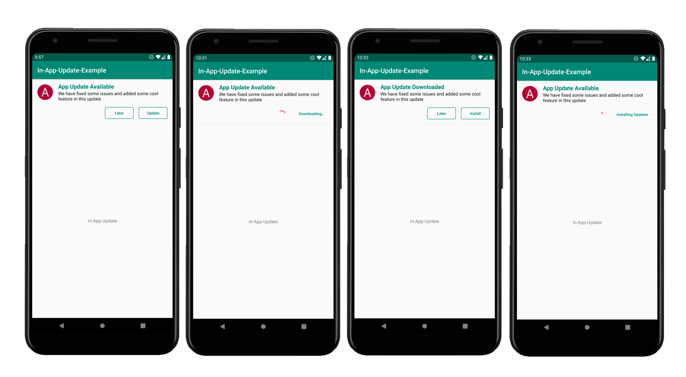

# In-App-Updates-Example

Medium Blog -> https://medium.com/@therajanmaurya/support-in-app-updates-implementation-example-df557932c79e

Usage
-----

Add [InAppUpdateUtils](InAppUpdateUtils.kt) and the UI layout in Dashboard xml [activity_main.xml](activity_main.xml)
and finally initialize InAppUpdateUtils in [MainActivity(Dashbaord Activity)](MainActivity.kt) class in your project and you are done.  

Test with internal app-sharing
------------------------------

With [internal app sharing](https://support.google.com/googleplay/android-developer/answer/9303479), you can quickly share an app bundle or APK with your internal team and testers by uploading the app bundle you want to test to the Play Console.

You can also use internal app sharing to test in-app updates, as follows:

1. On your test device, make sure you've already installed a version of your app that meets the following requirements:
   - The app was installed using an internal app sharing URL
   - Supports in-app updates
   - Uses a version code that's lower than the updated version of your app
   
2. Follow the Play Console instructions on how to [share your app internally](https://support.google.com/googleplay/android-developer/answer/9303479). Make sure you upload a version of your app that uses a version code that's higher than the one you have already installed on the test device.

3. On the test device, only click the internal app-sharing link for the updated version of your app. Do not install the app from the Google Play Store page you see after clicking the link.

4. Open the app from the device's app drawer or home screen. The update should now be available to your app, and you can test your implementation of in-app updates.
